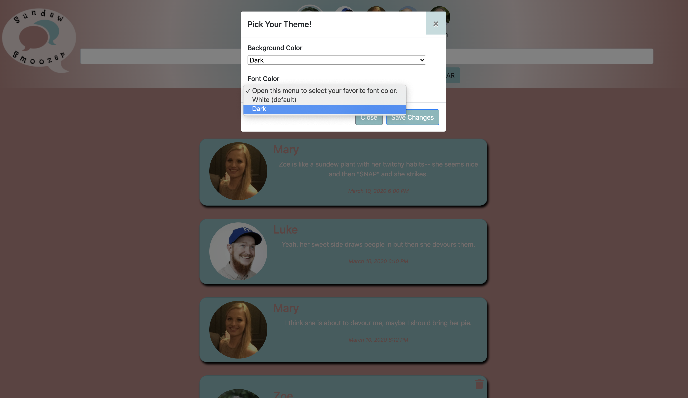
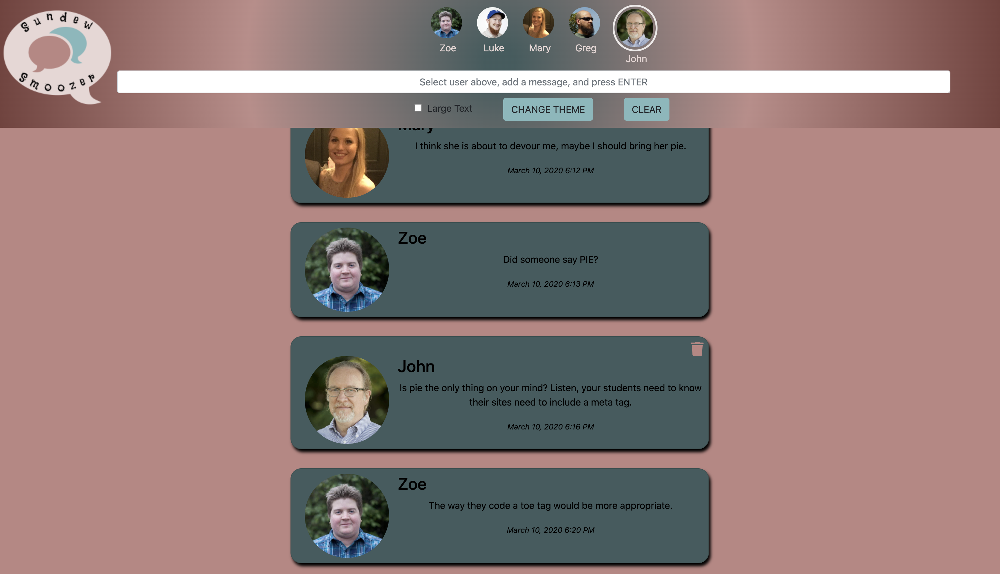

# Sundew Smoozer

[Check it out here!](https://sundews-7cdbf.firebaseapp.com/)

## Description
Sundew Smoozer is a messaging application. Users can select a user profile, add a message to the conversation, and delete one of their own messages. The user’s message gets validated to make sure it includes content; otherwise, the user is prompted with a popup informing him that he needs to add a message to send one. Additional options include clearing all messages, changing the site color theme to a dark mode, and enlarging the font size. This project was an opportunity to hone our skills for working together in the same codebase, ordering tickets as necessary based on dependencies, organizing project files into the appropriate structure following ES6 module setup, introducing SCSS extensions in our code, using jQuery more extensively, and standardizing our code by using ESLint. 
Project instructions can be found in the Github Project tickets here: https://github.com/nss-evening-cohort-11/chatty-sundews/projects/1.

## Individual Contribution
My contributions to this project included:
* The functionality to add a new message by typing in text and pressing the Enter key
* Validating that there is text so that blank messages do not get added to the conversation by mistake
* Adding a Clear button to quickly delete all current messages
* Adding the modal that gives users the ability to change the color of the font and page display
* Making message cards responsive
* Filtering access to deleting individual messages so that users can delete only the messages of their selected user

## Screenshots

##### Home Page (Light Mode)

##### Home Page (Dark Mode with Large Text)

##### Choosing Color Theme

##### Selecting a User

##### Validation of a New Message

##### Restricted Access to Deleting Messages

## Technologies Used:
* Bootstrap
* CSS
* ES6 Modules
* ESLint
* Github
* HTML5
* JavaScript
* jQuery
* moment.js
* Sass
* Webpack

## How to Run
1. Clone down this repo.
1. Make sure you have http-server installed via npm. If not, get it [here](https://www.npmjs.com/package/http-server).
1. On your command line, run `hs -p 9999`.
1. In your browser, navigate to `http://localhost:9999`.

## Contributors:
[Sarah Holder](https://github.com/sarahholder)

[John Johnson](https://github.com/John-Ryan-Johnson)

[Jose Marquez](https://github.com/Jmarquez8951)

[Anca Simon](https://github.com/ancasimon)

## Firebase Deployment
This project has been deployed with Firebase. 
You can access it [here](https://sundews-7cdbf.firebaseapp.com/). 
