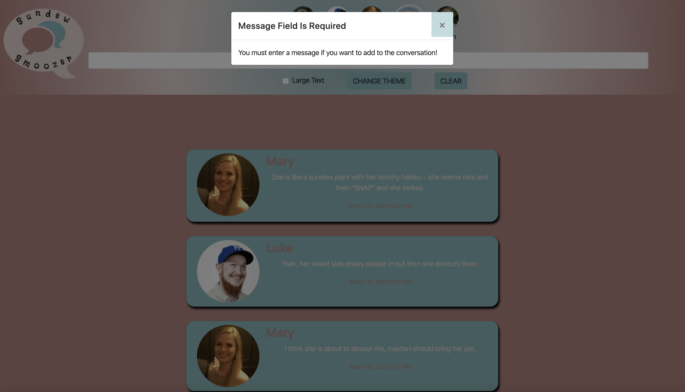

# Sundew Smoozer

## Description
Sundew Smoozer is a messaging application that allows the user to select user and send message and add to the conversation. Additional options include deleting messages, setting dark mode, adjusting font-size, clearing all messagesm and validating to ensure a message has been typed.
This was our second group project and helped us improve our teamwork skills and review all we had learned in our first two milestones in the front-end portion of the bootcamp. 

## Individual Contribution
My contributions to this project included:
* The functionality to add a new message by typing in text and pressing the Enter key only
* Validating that there is text so that blank messages do not get added to the conversation by mistake
* Adding the modal that gives users the ability to change the color of the font and page display
* Adding a Clear button to quickly delete all current messages
* Making message cards responsive
* Filtering access to deleting individual messages so that users can delete only the messages of their selected user

## Screenshots

##### Home Page (Light Mode)

##### Home Page (Dark Mode with Large Text)

##### Selecting a User

##### Validation of a New Message

## Technologies Used:
* HTML5, CSS and JavaScript
* jQuery
* SASS
* Bootstrap
* Webpack
* ES6 modules

## How to Run
1. Clone down this repo.
1. Make sure you have http-server installed via npm. If not, get it [here](https://www.npmjs.com/package/http-server).
1. On your command line, run `hs -p 9999`.
1. In your browser, navigate to `http://localhost:9999`.

## Contributors:
[Sarah Holder](https://github.com/sarahholder)

[John Johnson](https://github.com/John-Ryan-Johnson)

[Jose Marquez](https://github.com/Jmarquez8951)

[Anca Simon](https://github.com/ancasimon)

